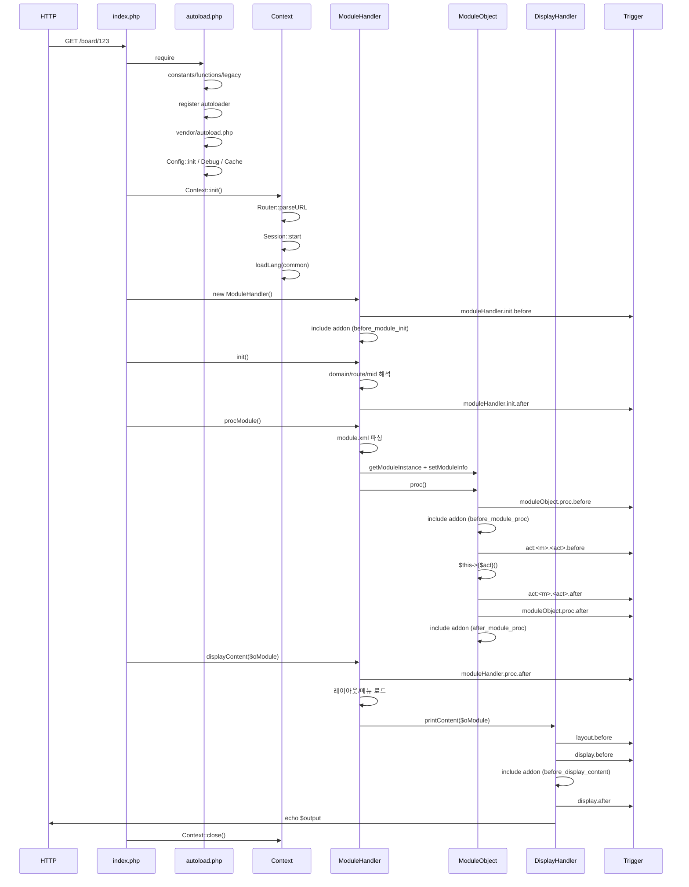

# 04. 부트스트랩과 요청 라이프사이클

HTTP 요청이 `index.php`에 도착해서 응답이 출력되기까지의 전체 흐름을 설명한다.

## 진입점: `index.php`

`index.php` (`index.php`)는 매우 얇다.

```php
require __DIR__ . '/common/autoload.php';      // (1) 부트스트랩
Context::init();                                // (2) 요청 컨텍스트 초기화
if (PHP_SAPI !== 'cli')                         // (3) HTTP 모드
{
    $oModuleHandler = new ModuleHandler();
    $oModuleHandler->init() && $oModuleHandler->displayContent($oModuleHandler->procModule());
    Context::close();
}
else                                            // (3') CLI 모드
{
    Rhymix\Framework\Debug::disable();
    ModuleHandler::procCommandLineArguments($argv);
}
```

CLI 모드 상세는 [21-cli-and-scripts.md](21-cli-and-scripts.md).

## 1. 부트스트랩 — `common/autoload.php`

### PHP 버전/인코딩 검사

- `PHP_VERSION_ID < 70400`이면 500 응답으로 종료 (`common/autoload.php:14-19`).
- `error_reporting(E_ALL)`, `date_default_timezone_set(@date_default_timezone_get())` 호출 (`:24-29`).
- `default_charset = UTF-8` 강제, `mb_internal_encoding`/`mb_regex_encoding` 설정 (`:34-39`).

### 상수/함수 로드

```php
require_once __DIR__ . '/constants.php';   // RX_* 상수
require_once __DIR__ . '/functions.php';   // 전역 함수
require_once __DIR__ . '/legacy.php';      // XE 호환 헬퍼
```

`common/constants.php`가 정의하는 상수 일람은 [12-helpers-and-globals.md](12-helpers-and-globals.md) 참고. 핵심:

| 상수 | 의미 |
|---|---|
| `RX_VERSION` | 현재 버전 (예: `2.1.35`) |
| `RX_MICROTIME` | 스크립트 시작 microtime |
| `RX_TIME` | 시작 unix time (int) |
| `RX_BASEDIR` | 서버측 절대경로 (trailing `/`) |
| `RX_BASEURL` | 클라이언트측 경로 (도메인 미포함) |
| `RX_REQUEST_URL` | `RX_BASEURL` 이후 URL 부분 |
| `RX_CLIENT_IP` | 방문자 IP (CloudFlare 실제 IP 추출 포함) |
| `RX_CLIENT_IP_VERSION` | 4 또는 6 |
| `RX_SSL` | 현재 요청이 HTTPS인가 |
| `RX_POST` | POST 메서드인가 |
| `RX_WINDOWS` | 윈도우 OS인가 |
| `RX_STATUS_*` | 댓글 모듈 호환용 숫자 상태 코드 11종(문서 테이블은 `PUBLIC` 등 문자열 저장) |
| `__XE__`, `__ZBXE__`, `__XE_VERSION__` 등 | XE 호환 마커 |

### autoloader 등록

`spl_autoload_register`로 등록한 클로저가 4단계 분기로 클래스를 찾는다. 상세는 [26-namespaces-and-autoload.md](26-namespaces-and-autoload.md). 요약:

1. `Rhymix\(Framework|Addons|Modules|Plugins|Themes|Widgets)\...\Class` → 디렉토리 매핑.
2. `$GLOBALS['RX_AUTOLOAD_FILE_MAP']` 정적 매핑.
3. `(Module)(Admin)?(View|Controller|Model|Item|Api|Wap|Mobile)?` 정규식 → `modules/<module>/<module>[.admin][.<kind>|.class].php`.
4. `$GLOBALS['RX_NAMESPACES']`의 외부 플러그인 namespace.

### Composer autoloader

```php
require_once RX_BASEDIR . 'common/vendor/autoload.php';
```

이 시점에서 모든 외부 PHP 패키지가 사용 가능해진다.

### 핵심 클래스 강제 로드

다음 7개 파일은 autoloader를 거치지 않고 즉시 `require_once`된다 (`common/autoload.php:125-131`).

- `classes/context/Context.class.php`
- `classes/object/Object.class.php`
- `common/framework/Cache.php`
- `common/framework/Config.php`
- `common/framework/DateTime.php`
- `common/framework/Debug.php`
- `common/framework/Lang.php`

### 설정 및 시스템 초기화

```php
Rhymix\Framework\Config::init();                       // files/config/config.php 로드
if (file_exists(RX_BASEDIR . 'config/config.user.inc.php')) {
    require_once RX_BASEDIR . 'config/config.user.inc.php';   // 사용자 override
}
Rhymix\Framework\Debug::registerErrorHandlers(...);    // 에러/예외 핸들러
date_default_timezone_set(...);                        // 내부 timezone 설정
ini_set('curl.cainfo', ...);                           // CA 번들
ini_set('openssl.cafile', ...);
Rhymix\Framework\Cache::init(Config::get('cache'));    // 캐시 드라이버 초기화
```

부트스트랩 종료 시점에는 다음이 준비된다:

- 모든 상수 정의 완료.
- autoloader 동작 준비.
- 설정값 사용 가능.
- 캐시/타임존/에러 핸들러 가동.
- DB는 아직 연결 전.

## 2. `Context::init()`

`classes/context/Context.class.php:187`. 다음 순서로 작업한다.

1. **중복 호출 방지** — `_init_called` 플래그 (`:189-194`).
2. **DB 설정 로드** — `loadDBInfo()` (`:203`).
3. **전역 변수 sanitize** — `_checkGlobalVars()` 안에서 `_check_patterns`(`:140`) 정규식으로 입력 검사 (`:206`).
4. **HTTP 요청 분석** — `setRequestMethod()`, `Router::parseURL()`로 URL을 모듈/액션/변수로 분해, `setRequestArguments`(`:207-219`). 이 과정의 `_filterRequestVar()`(`:1483`)가 개별 요청 변수를 필터링한다. `success_return_url`/`error_return_url`은 **비(非)GET 요청(POST 등)에 한해** `URL::isInternalURL()`로 내부 URL 여부를 검사해 외부 URL이면 `security_check='DENY ALL'` 처리 후 값을 제거한다 (`:1533-1541`). GET 요청은 elseif 체인의 앞선 분기(`:1525`)에서 escape만 되고 이 검증에 도달하지 않는다 (자세한 내용은 `19-security.md` Open Redirect 참고).
5. **업로드 정리** — `setUploadInfo()` — `$_FILES`를 일반 입력과 같은 형태로 변환 (`:220`).
6. **`site_module_info` 결정** — 설치 상태면 `ModuleModel::getDefaultMid()`, 아니면 임시 객체 (`:222-250`).
7. **SSL 강제** — `site_module_info->security !== 'none'`이고 현재 HTTPS가 아니면 301 redirect (`:252-258`).
8. **다국어 결정** — 우선순위: 사이트 강제 언어 → URL `l` → 쿠키 → UA `Accept-Language` → 사이트 기본 → `config('locale.default_lang')` → `ko`. 결정 후 `common`/`module` lang 로드 (`:260-319`).
9. **세션 핸들러 등록** (DB 세션일 때) → 현재 `Request`의 route option `enable_session`이 참일 때만 `Session::start(false)`. `cache_control` option도 이 단계에서 적용 (`:329-355`). 이 option들은 액션의 `session`/`cache-control` 메타데이터에서 온다 (`Router.php:495-517`).
10. **출력 버퍼 시작** — `ob_start()` (HTTP일 때만) (`:357-361`).
11. **인증 정보 설정** — 로그인 회원이면 `MemberController::setSessionInfo()`, 아니면 `is_logged=false` (`:363-375`).
12. **Debug 활성 여부 결정** — `Debug::isEnabledForCurrentUser()` (`:378`).
13. **`current_url`/`request_uri` 설정** — IDN xn-- 디코딩 포함 (`:380-398`).
14. **Mobile 컨텍스트 변수** — `m=1` 또는 `0` (`:401`).
15. **사이트 잠금 검사** — `config('lock.locked')`면 잠금 페이지 강제 (`:404-407`).

CSRF 토큰 검증은 Context가 아니라 ModuleHandler::procModule에서 수행한다(아래 §5). 상세는 [05-context.md](05-context.md).

## 3. `new ModuleHandler()`

`classes/module/ModuleHandler.class.php:58`. 생성자 동작:

1. **설치 여부 확인** — `Context::isInstalled()`가 false면 `$this->module = 'install'`로 설정하고 종료 (`:61-66`).
2. **보안 체크 결과 처리** — `$oContext->security_check`가 `ALLOW ADMIN ONLY`/`DENY ALL`이면 에러 (`:69-87`).
3. **요청 변수 추출** — `module`, `act`, `mid`, `document_srl`, `module_srl`, `route` (`:90-97`).
4. **모바일 감지** — `Mobile::isFromMobilePhone()` (`:97`).
5. **`entry` alias 처리** — XE 호환 alias 변환 (`:98-101`).
6. **`mid=admin` 보정** — admin mid를 admin 모듈로 변환 (`:102-106`).
7. **트리거 호출** — `moduleHandler.init.before` (`:109`).
8. **애드온 hook** — `before_module_init` 위치의 컴파일된 애드온 include (`:112-115`).

## 4. `init()`

`ModuleHandler::init()` (`classes/module/ModuleHandler.class.php:122`). 반환값은 boolean — false면 리다이렉트로 처리되어 `displayContent`를 건너뛴다.

1. **미등록 도메인 처리** (`:127-166`):
   - `site_module_info` 누락 또는 대체된 경우.
   - `config('url.unregistered_domain_action')` 값으로 분기:
     - `redirect_301` / `redirect_302` — 기본 도메인으로 리다이렉트.
     - `block` — 404 출력.
     - `display` (기본) — 임시 도메인으로 처리 계속.
2. **라우터 에러 처리** — `route->getRouteStatus() > 200`이면 404 (`:168-175`).
3. **entry → document_srl 변환** (`:177-185`).
4. **document_srl로 module_info 역추적** (`:187-198`).
5. **mid → module_info 매핑** (`:200-204`).
6. **도메인 일치 검증** — 다른 도메인의 mid면 404 (`:206-215`).
7. **기본 모듈 결정** (`:217-221`).
8. **index 문서 설정** (`:223-227`).
9. **레이아웃 srl 결정** — PC/Mobile 분기, `-1`(사이트 기본)/`-2`(PC와 공유) 처리 (`:237-274`).
10. **컬러 스키마 설정** (`:282`).
11. **트리거 호출** — `moduleHandler.init.after` (`:303`). false 반환 시 에러로 진행.

## 5. `procModule()`

`ModuleHandler::procModule()` (`:320`).

1. **에러 처리** — `$this->error`가 있으면 message 모듈로 변환해 반환 (`:326-329`).
2. **module.xml 로드** — `ModuleModel::getModuleActionXml($this->module)` (`:332`).
3. **`act` 결정** — 미지정 시 `default_index_act` 폴백. 그래도 없으면 404 (`:334-353`).
4. **타입/kind/meta-noindex 결정** — admin이 포함된 액션은 `kind='admin'` (`:355-370`).
5. **HTTP 메서드 검사** — `action.method`에 현재 메서드가 없으면 405 (`:372-380`).
6. **CSRF 검증** — 비-GET/HEAD/OPTIONS + `check_csrf !== 'false'` + 설치됨이면 `Security::checkCSRF()`. 실패 시 403 (`:382-388`).
7. **standalone 검사** — `standalone === 'false'`이고 mid 없으면 403 (`:391-402`).
8. **`use_mobile` 조정** — 모듈이 모바일 미지원이면 Mobile::setMobile(false) (`:404-412`).
9. **회원 메뉴 lang 재할당** (`:414-419`).
10. **모듈 인스턴스 생성** (`:421-469`):
    - `class_name`이 있으면 `Rhymix\Modules\<Module>\<class>` 풀네임으로 `class_exists` 후 `getInstance()` (v2).
    - 그 외엔 `getModuleInstance($module, $type, $kind)` (v1). 못 찾으면 `getModuleDefaultClass()` fallback.
11. **액션 미존재 시 forward 탐색** — 액션 이름에서 모듈명 역추론 또는 `getActionForward()` (`:471-617`).
12. **ruleset 검증** — `ruleset=` 지정 시 `Validator` 실행. v2 모듈에서는 deprecation warning (`:619-665`).
13. **`setAct` + `setModuleInfo($module_info, $xml_info)`** — 스킨/레이아웃/권한 설정 (`:667-670`).
14. **type이 `view`/`mobile`이고 non-admin이면 도메인 헤더/푸터/타이틀 주입** (`:672-690`).
15. **`$oModule->proc()` 호출** (`:700`).
16. request method가 **XMLRPC/JSON/JS_CALLBACK이 아니면** 에러/메시지/redirect 결과를 세션 INPUT_ERROR로 저장 (`:702-740`; RAW도 포함).
17. JSON/XMLRPC 응답인 경우 같은 모듈의 API 인스턴스 추가 실행은 `ModuleObject::proc` 끝부분에서 처리(아래 §6 12단계).

## 6. `ModuleObject::proc()`

`classes/module/ModuleObject.class.php:802`.

1. `stop_proc` 플래그 검사.
2. **트리거** — `moduleObject.proc.before` (`:814`).
3. **애드온 hook** — `before_module_proc` 위치 (`:827-830`).
4. **권한 검사** — `module_srl && !$this->grant->access`면 `stop("msg_not_permitted_act")`.
5. **스킨 동기화** — `setLayoutAndTemplatePaths()` 재호출 (`:846-855`).
6. **트리거** — `act:<module>.<act>.before` (`:858-868`).
7. **액션 실행** — `$this->{$this->act}()` 호출. `Rhymix\Framework\Exception` 처리.
8. **트리거** — `act:<module>.<act>.after` (`:883`).
9. **응답 복사** — 액션 메서드가 `BaseObject`를 return하면 그 에러/메시지를 `$this`에 복사.
10. **트리거** — `moduleObject.proc.after`.
11. **애드온 hook** — `after_module_proc`.
12. **API 모듈 동시 실행** — JSON/XMLRPC 등 ajax 응답일 때 같은 모듈의 `<Module>Api` 인스턴스의 액션 동시 실행 → 응답 병합.

상세 권한/grant 매트릭스는 [06-module-handler-lifecycle.md](06-module-handler-lifecycle.md).

## 7. `displayContent()`

`ModuleHandler::displayContent()` (`:993`).

1. 모듈 객체 유효성/DB 연결 검사.
2. **트리거** — `moduleHandler.proc.after` (`:1012`).
3. HTML 응답이면:
   - `getRedirectUrl()` 있으면 즉시 리다이렉트 (`:1023-1047`).
   - 에러 있으면 `MessageView`로 변환 (`:1050-1075`).
   - 레이아웃 srl 확정 (`:1077-1098`).
   - 레이아웃 정보 로드 → `extra_vars`/`menus`/`menu_count`/`layout_info`를 컨텍스트에 주입 (`:1100-1198`).
4. HTTP 상태 코드 결정 (`:1201-1208`).
5. `DisplayHandler::printContent($oModule)` 호출 (`:1211-1212`).

상세: [08-display-and-response.md](08-display-and-response.md).

## 8. `DisplayHandler::printContent()`

응답 메서드(`Context::getResponseMethod()`)에 따라 핸들러 분기:

| 메서드 | 핸들러 | 출력 |
|---|---|---|
| 기본 (HTML) | `HTMLDisplayHandler` | 레이아웃+스킨 조합 |
| `JSON` | `JSONDisplayHandler` | JSON |
| `JS_CALLBACK` | `JSCallbackDisplayHandler` | JSONP |
| `XMLRPC` | `XMLDisplayHandler` | XML-RPC |
| `RAW` | `RawDisplayHandler` | 원본 |
| `xeVirtualRequestMethod=xml` | `VirtualXMLDisplayHandler` | XE 호환 |

각 핸들러의 `toDoc()`이 본문 문자열을 만들고, `printContent()`가 HTTP 헤더와 함께 출력한다. 이 트리거는 응답 방식과 무관하게 `DisplayHandler::printContent()`가 `layout.before` → `display.before` → addon `before_display_content` → `display.after` → 본문 출력(`print $output`; HTML일 때는 출력 버퍼 `echo $buff` 포함) 순으로 발사한다. 즉 `display.after`는 출력 버퍼를 `ob_get_clean`으로 캡처한 뒤, 실제 본문 출력(echo/print) 직전에 발사된다.

## 9. `Context::close()`

`classes/context/Context.class.php:435-448`. 요청 종료 시:

1. `DisplayHandler::$debug_printed`가 false면 `DisplayHandler::getDebugInfo()` 호출 — Debug 정보가 출력/기록된다 (별도의 도메인 트리거는 발사되지 않는다).
2. `Session::checkStart()`이 true면 `Session::close()`로 세션 저장.

PHP shutdown 단계에서는 `Debug::registerErrorHandlers`가 등록한 셧다운 핸들러가 fatal error 캡처/로깅을 수행한다.

## 시퀀스 다이어그램



## 트리거 호출 위치 일람

| 위치 | 트리거 이름 | position |
|---|---|---|
| `ModuleHandler::__construct` | `moduleHandler.init` | `before` |
| `ModuleHandler::init` 끝 | `moduleHandler.init` | `after` |
| `ModuleObject::proc` 시작 | `moduleObject.proc` | `before` |
| 액션 직전 | `act:<module>.<act>` | `before` |
| 액션 직후 | `act:<module>.<act>` | `after` |
| `ModuleObject::proc` 끝 | `moduleObject.proc` | `after` |
| `ModuleHandler::displayContent` 시작 | `moduleHandler.proc` | `after` |
| `DisplayHandler::printContent`에서 선택된 handler의 `toDoc()` 호출 직전 | `layout` | `before` |
| 출력 직전 | `display` | `before` |
| 본문 출력(echo/print) 직전, 출력 버퍼 캡처(`ob_get_clean`) 후 | `display` | `after` |

애드온 hook 위치는 4개: `before_module_init`, `before_module_proc`, `after_module_proc`, `before_display_content`.

이벤트 시스템 상세는 [13-event-and-trigger-system.md](13-event-and-trigger-system.md).
