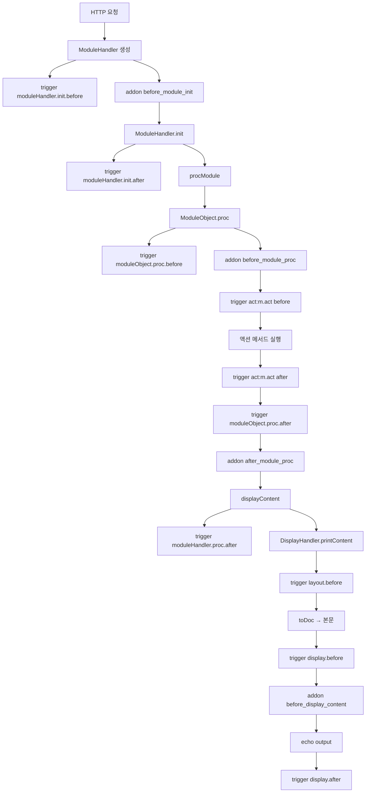

# 13. 이벤트 / 트리거 시스템

Rhymix의 hook 메커니즘은 **3가지 분리된 시스템**으로 구성된다.

1. **트리거(trigger)** — DB 또는 `module.xml`로 등록된 PHP 메서드를 위치별로 호출.
2. **애드온(addon)** — 컴파일된 PHP 파일을 4개 위치에서 `include`.
3. **글로벌 등록 함수** — 코드 단에서 runtime에 등록한 콜백.

## 1. 트리거

### 호출 API

`ModuleHandler::triggerCall($trigger_name, $called_position, &$obj)` (`classes/module/ModuleHandler.class.php:1293`). 세 번째 인자는 참조 전달이므로 트리거 핸들러가 객체를 변형할 수 있다.

```php
$output = ModuleHandler::triggerCall('document.insertDocument', 'before', $oDocument);
if (!$output->toBool()) {
    // 트리거가 거부함 → 처리 중단
}
```

- `$trigger_name` — 점(.) 구분 식별자. 예: `moduleHandler.init`, `act:board.dispBoardContent`, `document.insertDocument`.
- `$position` — `'before'` 또는 `'after'`.
- `$obj` — 컨텍스트 (모듈 인스턴스, 데이터 객체 등).
- 반환: `BaseObject`. 핸들러가 false를 리턴하면 `toBool()`이 false가 되어 호출자가 처리를 중단한다.

### 코어가 정의하는 트리거

#### 라이프사이클

| 이름 | position | 컨텍스트 |
|---|---|---|
| `moduleHandler.init` | before / after | `ModuleHandler` / `module_info` |
| `moduleHandler.proc` | after | `$oModule` |
| `moduleObject.proc` | before / after | `$this` (모듈) |
| `act:<module>.<act>` | before / after | `$this` / 액션 반환값 |
| `layout` | before | `$oModule` |
| `display` | before / after | `$output` (HTML 문자열) |

#### 통신 트리거

| 이름 | position | 컨텍스트 |
|---|---|---|
| `mail.send` | before / after | `Mail` 객체 |
| `sms.send` | before / after | `SMS` 객체 |
| `push.send` | before / after | `Push` 객체 |

#### 도메인 트리거 (예시)

| 이름 | 위치 |
|---|---|
| `module.dispAdditionSetup` | 관리자 모듈 설정 추가 UI |
| `module.getModuleAdminScopes` | 관리자 권한 스코프 등록 |
| `module.deleteModule` | 모듈 삭제 시 |
| `module.procModuleAdminCopyModule` | 모듈 복사 |
| `member.getMemberMenu` | 회원 메뉴 hook |
| `menu.getModuleListInSitemap` | 사이트맵 모듈 목록 |
| `document.insertDocument` | 문서 등록 (before/after) |
| `document.updateDocument` | 문서 수정 |
| `document.deleteDocument` | 문서 삭제 |
| `comment.insertComment` | 댓글 등록 |
| `comment.updateComment` | 댓글 수정 |
| `comment.deleteComment` | 댓글 삭제 |
| `file.insertFile` | 파일 업로드 |
| `file.deleteFile` | 파일 삭제 |

전수 검색은 `grep -RIn "triggerCall" modules/ common/ classes/`로 확인 가능하다.

(별도의 `common.flushDebugInfo` / `common.writeSlowlog` 같은 디버그 도메인 트리거는 코드에 정의되지 않는다 — Debug는 자체 정적 배열에 누적 후 `DisplayHandler::getDebugInfo()`가 직접 출력/로그한다.)

### eventHandlers XML

모듈의 `conf/module.xml`에 등록한다. `ModuleActionParser`가 파싱한다 (`common/framework/parsers/ModuleActionParser.php:288-314`).

```xml
<eventHandlers>
    <eventHandler before="document.insertDocument" class="controller" method="onBeforeInsertDocument" />
    <eventHandler after="document.insertDocument" class="controller" method="onAfterInsertDocument" />
    <eventHandler beforeaction="board.dispBoardContent" class="view" method="addAd" />
    <eventHandler afteraction="member.dispMemberInfo" class="Controllers\Foo" method="track" />
</eventHandlers>
```

| 속성 | 의미 |
|---|---|
| `before="<name>"` | 트리거 이름 (before position) |
| `after="<name>"` | 트리거 이름 (after position) |
| `beforeaction="<module>.<act>"` | `act:<module>.<act>` (before position)의 단축. 모듈명은 자동으로 붙지 않으므로 속성값에 `<module>.<act>` 전체를 직접 써야 한다 |
| `afteraction="<module>.<act>"` | `act:<module>.<act>` (after position)의 단축. 모듈명을 포함해야 한다 |
| `class` | 인스턴스 타입 (`controller`/`model`/`view`/`mobile`/`api`/`wap`/`class`) 또는 PSR-4 클래스명 (`Controllers\Foo`) |
| `method` | 호출할 메서드명 |

각 핸들러는 정확히 하나의 위치(`before`/`after`/`beforeaction`/`afteraction`)만 지정 가능.

### DB 등록

모듈 설치 시 `ModuleController::registerEventHandlers($module_name)`(`modules/module/module.controller.php:1467`)이 `module.xml`의 `event_handlers` 배열을 순회하며 새 항목은 `insertTrigger($trigger_name, $module, $class_name, $method, $position)`(`:75`)로 추가하고, 더 이상 정의되지 않은 핸들러는 `deleteTrigger(...)`(`:100`)로 제거한다. 저장 테이블은 **`module_trigger`**(`schemas/module_trigger.xml`)이며 `executeQuery('module.insertTrigger', $args)`를 사용한다. 캐시 키는 `'triggers'`. 기록 후 그 모듈이 비활성화되지 않는 한 모든 트리거 호출 시 자동 실행된다.

### 런타임 등록 (코드 단)

```php
ModuleController::getInstance()->insertTrigger(
    $trigger_name,       // 예: 'document.insertDocument'
    $module,             // 예: 'mymodule'
    $type,               // 'controller'/'model'/...
    $called_method,      // 메서드명
    $position            // 'before'/'after'
);
```

또는 한 요청 내에서만 활성 (DB 미저장, `$GLOBALS['__trigger_functions__']`에 적재):

```php
ModuleController::getInstance()->addTriggerFunction(
    'document.insertDocument',
    'before',
    function($obj) {
        // 처리
        return new BaseObject;
    }
);
// 또는 단축: getController('module')->addTriggerFunction(...);
```

### 슬로우 트리거 로깅

디버그가 켜진 경우(`Debug::isEnabledForCurrentUser()`) 임계값과 무관하게 모든 트리거가 `Debug::addTrigger(array $trigger)`로 기록된다(인자는 `['name', 'target', 'target_plugin', 'elapsed_time']` 키의 배열). 그중 `config('debug.log_slow_triggers')` 임계값(초) 이상인 트리거만 별도의 느린 트리거 목록(`$_slow_triggers`)에 추가된다. 기본 설정값은 `0.25`이며(`common/defaults/config.php:109`), 코드의 `?? 1`은 이 설정 키 자체가 없을 때만 적용되는 내부 폴백이다 (`common/framework/Debug.php:550-554`).

## 2. 애드온 (Addon)

### 4개 hook 위치

| 위치 | 시점 | 발생 코드 |
|---|---|---|
| `before_module_init` | `ModuleHandler::__construct` 끝 | `ModuleHandler.class.php:112-115` |
| `before_module_proc` | `ModuleObject::proc` 시작 | `ModuleObject.class.php:827-830` |
| `after_module_proc` | `ModuleObject::proc` 끝 | (마찬가지) |
| `before_display_content` | `DisplayHandler::printContent` | `DisplayHandler.class.php:73-76` |

### 동작

모든 활성 애드온의 PHP 코드가 **하나의 캐시 파일로 컴파일**된다.

- 위치: `files/cache/addons/pc.php`, `files/cache/addons/mobile.php`.
- 캐시 생성기: `AddonController::makeCacheFile($site_srl, $type, $gtype)` (`modules/addon/addon.controller.php:72`).
- 생성 단위: PC / 모바일 분리. 다국어는 컴파일 시점이 아니라 런타임에 처리.
- 진입 경로 조회: `AddonController::getCacheFilePath($type)`.

요청 시 `include`되며, 애드온 PHP 파일 내부에서 `$called_position` 변수로 분기:

```php
if ($called_position == 'before_module_proc') {
    // ...
}
if ($called_position == 'after_module_proc' && Context::getResponseMethod() == 'HTML') {
    Context::loadFile('./addons/myaddon/myaddon.js');
}
```

### 활성화 단위

- 사이트 전체 (`addons/` 디렉토리에 설치).
- 모듈별 (모듈 설정에서 개별 활성/비활성).
- PC / 모바일 별도.

### 컴파일 캐시 무효화

- 애드온 활성화/비활성화 시 (관리자 UI에서 `makeCacheFile` 재호출).
- `addon.controller.php`(코어 애드온 컨트롤러) 갱신 시 — `getCacheFilePath`가 `filemtime($addon_file) < filemtime(__FILE__)`(`addon.controller.php:42`)로 캐시 파일과 컨트롤러 파일 자신의 mtime만 비교한다. 개별 애드온의 `*.addon.php` 파일 mtime은 비교 대상이 아니므로 애드온 코드를 수정해도 캐시 파일 자체는 재컴파일되지 않는다. 다만 캐시는 애드온 코드를 인라인하지 않고 `include($addon_file)`로 원본을 불러오므로(`addon.controller.php:111,132`), 코드 수정은 캐시 재생성 없이도 다음 요청에서 곧바로 반영된다. 캐시 재생성이 실제로 필요한 경우는 활성 애드온 목록·설정·mid 조건이 바뀔 때뿐이다.

### 실예시: `addons/autolink/autolink.addon.php`

```php
<?php
if (!defined('__XE__')) exit();

if ($called_position == 'after_module_proc' && Context::getResponseMethod() == 'HTML') {
    Context::loadFile(['./addons/autolink/autolink.js', 'body', '', null], true);
}
```

모듈 처리 후 HTML 응답일 때만 자동링크 JS를 로드한다.

상세 작성법: [27-extension-points/addon.md](27-extension-points/addon.md).

## 3. 글로벌 등록 함수

`ModuleHandler::triggerCall`이 DB 등록 트리거를 모두 실행한 뒤, `ModuleModel::getTriggerFunctions($name, $position)`로 코드 단 등록 콜백도 실행한다 (`ModuleHandler.class.php:1372-1424`).

```php
ModuleController::getInstance()->addTriggerFunction(
    'act:board.dispBoardContent',
    'before',
    function($oModule) {
        Context::set('extra_data', '...');
    }
);
```

내부적으로는 `$GLOBALS['__trigger_functions__'][$name][$position][]`에 추가되며 **요청 단위로 휘발**된다. 영구 등록은 DB 트리거 또는 module.xml을 사용한다.

## 트리거 vs 애드온 선택 기준

| 상황 | 권장 |
|---|---|
| 특정 모듈/액션의 데이터 가공 | 트리거 |
| 모든 페이지에 JS/CSS 추가 | 애드온 (`after_module_proc` 또는 `before_display_content`) |
| 응답 HTML 직접 가공 | 애드온 (`before_display_content`) |
| 도메인 이벤트(문서 등록 등)에 hook | 트리거 |
| 요청 차단/리다이렉트 | 애드온 (`before_module_init`) |

## 흐름 시각화



## 디버깅 팁

- 디버그 모드에서 `display_content`에 `entries` 추가 시 어느 트리거가 발사됐는지 확인 가능.
- `config('debug.log_slow_triggers')`로 느린 트리거 자동 기록.
- 트리거가 실행되지 않는 듯하면 DB의 `module_trigger` 테이블 확인.

## 다음 문서

- 새 애드온 만들기: [27-extension-points/addon.md](27-extension-points/addon.md)
- 새 모듈 만들기 (eventHandlers 등록): [27-extension-points/module.md](27-extension-points/module.md)
